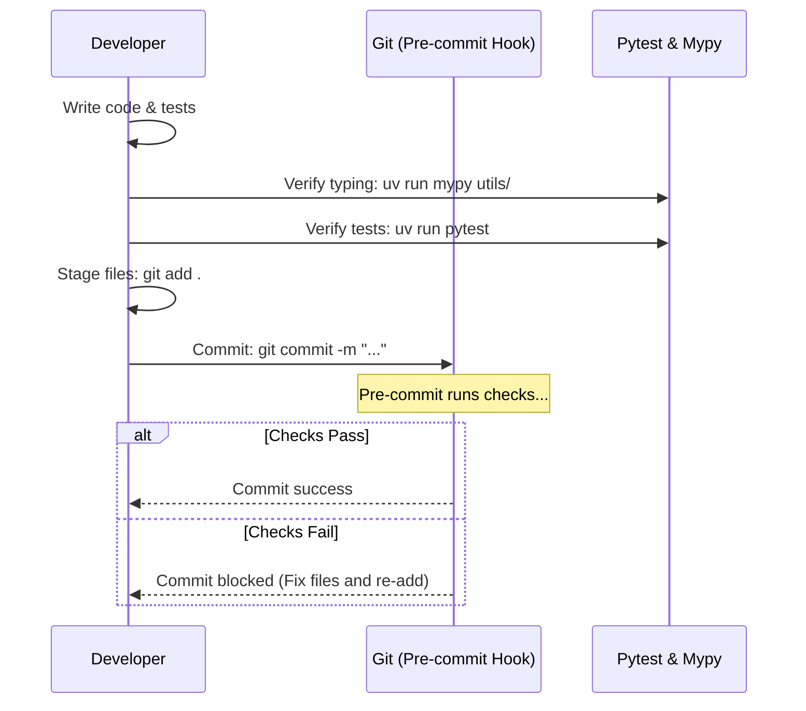

# Developer Tooling & Workflow Guide

This document describes the modern development ecosystem configured for the `py-utils` project, detailing the tools, configurations, running commands, and their benefits.

---

## 1. Package & Environment Management: `uv`

[`uv`](https://github.com/astral-sh/uv) is an extremely fast Python package installer and resolver designed as a drop-in replacement for `pip`, `pip-tools`, and `virtualenv`.

### Benefits
*   **Performance:** Written in Rust, it is up to 10–100x faster than standard Python package managers.
*   **Workspace Isolation:** Automatically manages a project-local virtual environment (`.venv`) for you.
*   **Lockfile Support:** Uses a deterministic lockfile (`uv.lock`) to ensure that all developers and CI run exactly the same package versions.
*   **Seamless Tool Running:** Runs scripts and commands in the context of the virtual environment without needing to manually source/activate it (via `uv run`).

### Common Commands
*   **Run a command inside the environment:**
    ```bash
    uv run <command>
    ```
*   **Add a production dependency:**
    ```bash
    uv add <package_name>
    ```
*   **Add a development-only dependency:**
    ```bash
    uv add --dev <package_name>
    ```
*   **Sync local environment with lockfile:**
    ```bash
    uv sync
    ```

---

## 2. Linting & Formatting: `ruff`

[`ruff`](https://github.com/astral-sh/ruff) is an ultra-fast Python linter and code formatter written in Rust. It replaces tools like `black`, `isort`, `flake8`, `autoflake`, and `pyupgrade`.

### Benefits
*   **Speed:** Running checks takes milliseconds instead of seconds.
*   **All-in-one:** Simplifies your configuration by replacing 5+ separate tooling configurations with a single tool.
*   **Safe Fixes:** Can automatically fix hundreds of common issues (unused imports, style deviations, etc.) in-place.

### Common Commands
*   **Analyze codebase for style violations:**
    ```bash
    uv run ruff check .
    ```
*   **Automatically fix safe violations:**
    ```bash
    uv run ruff check --fix .
    ```
*   **Auto-format code files:**
    ```bash
    uv run ruff format .
    ```

---

## 3. Testing & Coverage: `pytest` & `pytest-cov`

[`pytest`](https://docs.pytest.org/) is the industry-standard test framework for writing clean, readable unit and integration tests. [`pytest-cov`](https://github.com/pytest-dev/pytest-cov) integrates coverage reporting into the test suite.

### Benefits
*   **Simple Syntax:** Write simple assert statements rather than complex assertion methods.
*   **Path Resolution:** Configured to automatically put the project root on the python import path (via `pythonpath = ["."]` in `pyproject.toml`).
*   **Coverage Insights:** Identifies exactly which lines of code are covered by tests and warns you of untested branches.

### Common Commands
*   **Run the test suite:**
    ```bash
    uv run pytest
    ```
*   **Run tests with detailed coverage reporting:**
    ```bash
    uv run pytest --cov=utils --cov-report=term-missing
    ```

---

## 4. Static Type Checking: `mypy`

[`mypy`](http://mypy-lang.org/) is a compile-time static type checker for Python. It checks type annotations (like `def func(x: int) -> str`) without running the code.

### Benefits
*   **Early Bug Detection:** Finds type mismatch errors, invalid optional type dereferences, and incorrect API calls before runtime.
*   **Documentation:** Type signatures serve as self-documenting code agreements.
*   **Safety:** Ensures that data structures conform to expected schemas, reducing runtime bugs.

### Common Commands
*   **Run static analysis on code:**
    ```bash
    uv run mypy utils/
    ```

---

## 5. Automated Pre-Commit Checks: `pre-commit`

[`pre-commit`](https://pre-commit.com/) is a framework for managing and maintaining multi-language git pre-commit hooks.

### Benefits
*   **Gatekeeping:** Prevents broken, poorly formatted, or raw/un-styled code from ever entering your Git repository history.
*   **Automation:** Runs tests, formatting, and linting automatically every time you run `git commit`. If a hook fails (e.g. Ruff reformats a file), the commit is blocked so you can inspect and stage the fixed code.

### Configured Hooks (in `.pre-commit-config.yaml`)
1.  **Trailing Whitespace:** Trims trailing whitespace at the end of lines.
2.  **End of File Fixer:** Ensures files end with a trailing newline.
3.  **Check YAML:** Validates YAML syntax.
4.  **Check Added Large Files:** Prevents accidentally committing huge binaries.
5.  **Ruff Linter/Formatter:** Verifies code styling and format.
6.  **Mypy Type Checking:** Performs type check checks.

### Common Commands
*   **Register hooks with your local git repository (one-time setup):**
    ```bash
    uv run pre-commit install
    ```
*   **Run all hooks manually against all files:**
    ```bash
    uv run pre-commit run --all-files
    ```

---

## 6. Interactive Shell: `ipython`

[`IPython`](https://ipython.org/) is an interactive command shell that offers a much richer experience than the default `python` REPL.

### Benefits
*   **Tab Completion:** Complete variables, modules, and file paths dynamically.
*   **Object Inspection:** Run `object?` to view docstrings and details about variables and functions.
*   **History Persistence:** Remembers commands across sessions.

### Common Commands
*   **Launch IPython shell:**
    ```bash
    uv run ipython
    ```

---

## Standard Development Workflow Example

When working on a new feature or utility in this repository, follow this sequence:


